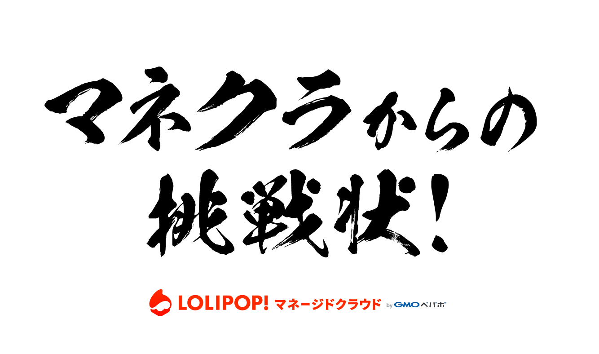

# Webページコードゴルフ

## 必要なもの

- PHP 7.3.2 ( PHP7以上であれば問題ないと思います )
- ssh
- rsync
- SQLite3

## レギュレーション

- PHPで作成されたサイト https://phpconfuk-codegolf-php.lolipop.io/ （正解サイト）のソースコードをお渡しします（このリポジトリです）。
- サイトの **表示を一切変えずに** Webサイトを構成する全コード全ファイルの合計ファイルサイズを小さくして、あなたのマネクラの `PHPプロジェクト` にデプロイしてください。
- 最も小さいファイルサイズになった人が優勝です
- コンテナ内の `/var/www/html` 内に全てのコード、およびファイルを設置してください
- Makefile内の `check` タスク内のコマンドの変更は禁止です

## はじめかた

1. マネクラで新規PHPプロジェクトを作成します
1. このリポジトリを `git clone` します
2. Makefile内の先頭にある環境変数を作成したPHPプロジェクトのものに書き換えます
    - SSH_PORT
    - SSH_USER
    - DB_NAME
    - DB_USER
    - DB_PASS
3. ローカルで以下のコマンドを実行します
    - `make install`
4. `make server` を実行し、ブラウザで http://localhost:8000 で "マネクラからの挑戦状" の表示があれば開発環境の構築完了です。

## スコアチェック手順

1. `make deploy` を実行し、手元のソースコードをデプロイします。
2. マネクラダッシュボードの `プロジェクトURL` にアクセスして "マネクラからの挑戦状" の表示があればデプロイ設置完了です。
3. https://phpconfuk-codegolf.lolipop.io/ にアクセスします
4. テキストフィールドにあなたのプロジェクトの `プロジェクトURL` を入力して `Show Diff` をクリックします
5. `Great!!! There is no difference !!!` と表示されたら **表示を一切変更していない** ことが認められました！
    - `Oh... There is a difference` と表示されたら失敗です。差分を確認して、修正して、再度挑戦してください。
6. このとき `make check` を実行してください。出てきた数字が現在のあなたのスコアです。小さければ小さいほど良いです。
7. スタッフに3のページと4の結果を見せてください。これでスコアが正式に認められました。

## ヒント

- [アプリケーションのログやアクセスログの確認方法](https://mclolipop.zendesk.com/hc/ja/articles/360022532394-%E3%82%A2%E3%83%97%E3%83%AA%E3%82%B1%E3%83%BC%E3%82%B7%E3%83%A7%E3%83%B3%E3%81%AE%E3%83%AD%E3%82%B0%E3%82%84%E3%82%A2%E3%82%AF%E3%82%BB%E3%82%B9%E3%83%AD%E3%82%B0%E3%81%AE%E7%A2%BA%E8%AA%8D%E6%96%B9%E6%B3%95)
